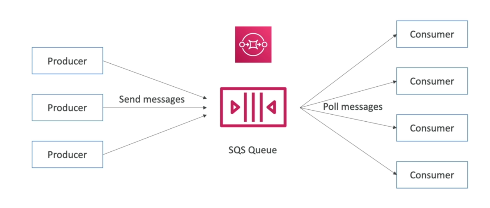

I will continue noting The remaining AWS services in this .md file, because I noticed that the md file is easier to read and style.

- AWS Services:

  - SQS:
    Amazon Simple Queue Service (SQS) is a fully managed message queuing service provided by Amazon Web Services (AWS).
    It enables decoupling of the components of a cloud application by allowing them to communicate asynchronously.
    

    - Attributes:

      1. Unlimited Throughput, Auto Scaling.
      2. Default retention for a message in the queue 4 days maximum 14 days.
      3. Low latency < 10 ms on publish and recive.
      4. limitation of 256 kb per message, users cannot increase the default size beyond this limit.
      5. Can have duplicate and out of order messages.

    - Producer:

      1.  Can produce to the queue using the SDK (SendMessage API).
      2.  The message persists to the queue until the consumer deletes it.

    - Consumer:

      1. Running on EC2 instances, servers or AWS Lambda.
      2. Poll SQS messages up to 10 messages per second.
      3. Delete messages from the queue using DeleteMessage API.
         

      - Multiple EC2 instances Consumer:
        1. consumers recive messages and process them in parallel.
        2. we can scale consumers horizontally to increase throughput.

    - SQS with ASG:
      cloudWatch metrics based on the queue depth notifies the CloudWatch Alarm to scale the EC2 consumer instances.

      Auto Scaling Group launches instances based on defined policies.
      Instances retrieve messages from the SQS queue for processing.
      Auto Scaling Group scales based on SQS metrics (e.g., queue depth).
      Instances gracefully handle scale-in events.

      

    - SQS used also to decouple the application services:
      SQS allows you to decouple the components of a distributed application. Instead of components interacting directly, they can communicate by sending messages to a queue. This reduces the dependency between components and enhances the flexibility and scalability of the overall system.
      

    - SQS Security:

      1. Authentication and Authorization:
         AWS Identity and Access Management (IAM): Use IAM to control access to SQS resources.
      2. Secure Communication:

         - Amazon VPC Endpoints:
           If your application runs within an Amazon Virtual Private Cloud (VPC),
           consider using VPC endpoints for SQS to ensure that communication between your VPC and SQS does not traverse the public internet.

         - Secure Sockets Layer (in-flight Encryption) (SSL):
           Use HTTPS when connecting to SQS to encrypt data in transit. SQS supports both HTTP and HTTPS endpoints.

         - Server-Side Encryption (SSE):
           Enable Server-Side Encryption for SQS queues to automatically encrypt messages at rest. SQS supports SSE with Amazon S3-managed keys (SSE-S3) and AWS Key Management Service (KMS) keys (SSE-KMS).

      3. Access Control Policies:
         SQS Access Policies: Implement fine-grained access control using SQS access policies.
         Define policies that specify who can perform actions on a queue and under what conditions.

    - SQS Common use cases:

      1. Cross-Account Access
         Scenario:
         In this scenario, EC2 instances in Account A need to poll an SQS queue in Account B. This might happen when different AWS accounts are involved in a distributed system, and the EC2 instances in one account need to communicate with resources in another account.

         Access Policy:
         To allow cross-account access, you need to create an SQS access policy in Account B (the account with the SQS queue) that grants permissions to Account A (the account with the EC2 instances).

      2. Publish S3 Event Notification to SQS Queue
         Scenario:
         In this scenario, you want to receive event notifications from an S3 bucket in real-time and process them using an SQS queue. This is common when you want to asynchronously handle events like new object creation or deletion in an S3 bucket.

         Access Policy:
         For this use case, you need to configure the S3 bucket's event notifications and set up an SQS access policy to allow S3 to send events to the SQS queue.

         S3 Bucket Event Configuration:

         Configure the S3 bucket to send event notifications to the SQS queue. This is typically done through the AWS Management Console or using AWS CLI/SDKs.
         SQS Access Policy:

         The SQS queue needs a policy allowing the S3 service to send messages to the queue.

    - SQS Messages Visibility:

      The visibility timeout in Amazon Simple Queue Service (SQS) is a crucial parameter that defines the time during which a message is invisible to consumers after it has been received by one of them. This timeout helps prevent multiple consumers from processing the same message simultaneously.

      When a consumer retrieves a message from an SQS queue, the message becomes invisible to other consumers for a specified duration
      by default 30s known as the "visibility timeout."

      If the consumer successfully processes and deletes the message within the visibility timeout, everything proceeds as expected, and the message is removed from the queue.
      If the processing takes longer than the visibility timeout, the message becomes visible again in the queue, and other consumers can potentially retrieve and process it.

      If the processing takes longer than the visibility timeout, you can ask for more time by calling ChangeMessageVisibility API.

      You can set the visibility timeout when sending a message to an SQS queue. The default visibility timeout is 30 seconds, and you can set it to any value from 0 seconds to 12 hours.
      

    - Dead Letter Queue:
      A Dead Letter Queue (DLQ) is a feature in Amazon Simple Queue Service (SQS) that helps manage messages that cannot be processed successfully by consumers. When a message fails to be processed within a certain number of attempts, SQS can move it to a Dead Letter Queue, allowing you to analyze, debug, and take corrective actions on problematic messages.

      - Maximum Receives:
        You can set the maxReceiveCount property in the redrive policy to define the maximum number of times a message can be received (read) from the source queue before it is considered a failure. Once this limit is reached, the message is moved to the Dead Letter Queue.

      - Corrective Actions:
        After identifying the root cause, you can take corrective actions, such as fixing code issues, adjusting processing logic, or updating configurations.

      - Retry Mechanism:
        The Dead Letter Queue provides a way to implement a retry mechanism. Messages that fail initially can be retried until they reach the maximum receive count, at which point they are moved to the Dead Letter Queue.

    - Delay Queue:
      When you send a message to a Delay Queue, you can specify a delay time in seconds. The message will not be available for retrieval until the specified delay period elapses.

      During the delay period, the message is held in the queue, and consumers cannot receive it. This delay allows you to implement features such as delayed processing or scheduled tasks.

    - Long Polling:
      Long polling is a messaging communication pattern that is used to efficiently retrieve messages from a server without the need for continuous polling. In the context of Amazon Simple Queue Service (SQS), long polling is a feature that allows consumers to wait for messages to arrive in a queue for a specified amount of time, potentially reducing the number of empty responses and lowering costs associated with polling.
      Long polling in SQS provides an efficient and cost-effective way to retrieve messages in near real-time while minimizing the number of empty responses and optimizing network utilization. It is particularly beneficial for applications that require responsiveness and low-latency message retrieval.

    - SQS Extended Client:
      The SQS Extended Client is an extended version of the Amazon Simple Queue Service (SQS) client that enables you to send and receive large messages (beyond the SQS standard message size limit of 256 KB). This extended client uses Amazon Simple Storage Service (S3) to store the payload of large messages while keeping a reference to the S3 object in the SQS message.

      Instead of storing the entire message payload in SQS, the extended client stores the payload in an S3 bucket. The SQS message contains a reference to the S3 object, allowing consumers to retrieve the large payload from S3.
      

    - FIFO SQS Queue:
      This is a queuing principle where the first item that enters a queue is the first to be processed. It ensures that the order in which items are added to the queue is maintained during processing.

      To guarantee the Order of messages, the maximum throughput of the queue is 300 msg/s.

      - Deduplication:
        FIFO (First-In-First-Out) queues in Amazon Web Services (AWS) come with built-in support for message deduplication. This feature ensures that messages with the same content are not duplicated in the queue, allowing you to maintain a unique set of messages.

      - Message Grouping:
        You may need the order by consumers ID.
        

  - SNS

    Amazon Simple Notification Service (SNS) is a fully managed messaging service provided by Amazon Web Services (AWS). It enables you to build distributed, decoupled, and scalable applications by allowing you to send messages (notifications) to a distributed set of recipients or endpoints.

    Key features and concepts of AWS SNS:

    - Topics: In SNS, messages are sent to "topics," which act as communication channels or endpoints. Subscribers interested in receiving messages from a particular topic can subscribe to it.

    - Subscribers: Subscribers are the endpoints or clients that want to receive messages from a topic. Subscribers can include Amazon Simple Queue Service (SQS) queues, AWS Lambda functions, HTTP/HTTPS endpoints, email addresses, SMS text messages, and more.

    Protocols: SNS supports multiple protocols for delivering messages to subscribers. These include:

    Amazon SQS: Messages can be delivered to SQS queues.
    AWS Lambda: Messages can trigger Lambda functions.
    HTTP/HTTPS: Messages can be sent as HTTP/HTTPS POST requests to an endpoint.
    Email/Email-JSON: Messages can be sent as email or email with JSON content.
    Short Message Service (SMS): Messages can be sent as SMS text messages to mobile devices

    - Use case:
      S3 event send only for one receiver but if you need to send it to multiple SQS queues for example,you can send it to SNS and it will publish it to multiple SQS queues.
      Using Amazon SNS as an intermediary between S3 events and multiple SQS queues is a common and effective pattern. This architecture provides flexibility and decoupling, allowing you to easily scale and manage your system.

  ***

  - AWS Serverless:

    - Lambda
      Amazon Web Services (AWS) Lambda is a serverless compute service that allows you to run code without provisioning or managing servers. With Lambda, you can execute code in response to events, such as changes to data in an Amazon S3 bucket, updates to an Amazon DynamoDB table, or HTTP requests via an API Gateway. Lambda automatically scales and manages the compute resources needed to run your code, and you only pay for the compute time that you consume.

      - AWS Lambda provides several benefits that make it a popular choice for building scalable, serverless applications:

        1. **No Server Management:**

        - With Lambda, you don't need to worry about server provisioning, maintenance, or scaling. AWS takes care of all the underlying infrastructure, allowing you to focus on writing code and building features.

        2. **Cost-Effective:**

        - You pay only for the compute time that your code is actually running. Lambda automatically scales up and down based on the number of requests, so you don't incur costs when your code is not in use.

        First 1 million requests are free then 0,20$ per million requests.

        3. **Automatic Scaling:**

        - Lambda automatically scales your applications in response to incoming traffic. It can handle a large number of simultaneous executions, providing a highly scalable architecture.

        4. **Event-Driven Programming Model:**

        - Lambda functions can be triggered by various events from other AWS services or custom events. This event-driven model allows you to build applications that respond to changes in data, user actions, or other events.

        5. **Multi-Language Support:**

        - Lambda supports multiple programming languages, including Node.js, Python, Java, Ruby, Go, .NET Core, and custom runtimes. This flexibility enables developers to choose the language that best fits their application requirements.

        6. **Integration with AWS Services:**

        - Lambda seamlessly integrates with other AWS services, making it easy to build complex, multi-service architectures. For example, you can use Lambda with S3, DynamoDB, API Gateway, SNS, SQS, and more.

        7. **Quick Deployment:**

        - Lambda functions can be deployed quickly, allowing you to iterate on your code and deploy updates rapidly. This is particularly beneficial for continuous integration and continuous deployment (CI/CD) workflows.

        8. **Environment Variables:**

        - Lambda supports the use of environment variables, allowing you to store configuration settings separate from your code. This makes it easy to configure your functions for different environments (e.g., development, testing, production).

        9. **Built-in Fault Tolerance:**

        - AWS Lambda automatically monitors the health of your functions and replaces failed executions with new instances. This built-in fault tolerance helps ensure the reliability of your applications.

        10. **Security and Permissions:**

            - Lambda functions run in an execution role with defined permissions. This provides fine-grained control over what AWS resources your functions can access, enhancing security.

        11. **Global Reach:**
            - Lambda functions can be deployed in multiple AWS regions, allowing you to build applications that have a global reach with low-latency access for users around the world.

      - examples:
        example1: How Lambda works with S3 events.
        

        example2: Instead of using Ec2 to do an action every specific time, and waste cpu and memory
        Here's a simple example of the effectivness of the Lambda an serverless
        

      - Invocation types:
        AWS Lambda supports different invocation types, allowing you to control how your Lambda functions are triggered. The invocation type determines how an event is delivered to a function and how the function processes that event. There are two main invocation types for Lambda functions:

        - Synchronous Invocation:

          In synchronous invocation, the calling application waits for the Lambda function to process the event and returns the results immediately. The calling application includes the function's response in its own response to the user.
          This type is suitable for use cases where you require an immediate response and need to wait for the function to complete before proceeding.
          Invocation Methods:

          AWS Management Console:
          Invoking a function in the AWS Management Console results in synchronous invocation.
          AWS SDKs (e.g., AWS SDK for JavaScript, AWS SDK for Python):
          You can invoke a Lambda function synchronously using the SDKs.

        - Asynchronous Invocation:

          In asynchronous invocation, the calling application sends an event to the Lambda function and immediately receives a response without waiting for the function to complete. The event is placed into an event queue and processed by the function in the background.
          This type is suitable for use cases where you don't need an immediate response and want to decouple the calling application from the function's execution.
          Invocation Methods:

          Amazon S3: S3 can invoke Lambda functions asynchronously when objects are created or deleted.
          Amazon SNS: SNS can invoke Lambda functions asynchronously when messages are published to topics.
          AWS SDKs (e.g., AWS SDK for JavaScript, AWS SDK for Python): You can invoke a Lambda function asynchronously using the SDKs.

          If you want to handle failures or retries in case of an error during Lambda asynchronous invocation, one common approach is to use an Amazon SQS (Simple Queue Service) dead-letter queue (DLQ). The dead-letter queue is a queue where messages that cannot be processed successfully are sent, allowing you to investigate and handle them separately.
          By default, Lambda will attempt to retry the invocation twice with an exponential backoff before sending the message to the dead-letter queue.

          Ensure that your Lambda function has the necessary IAM permissions to access the DLQ and has full SQS access to be able to write to the DLQ.

          

      - AWS Services Integrations:

        - ALB (Application Load Balancer):
          When you integrate an AWS Lambda function with an Application Load Balancer (ALB), you can create a serverless architecture where HTTP requests to your ALB trigger the Lambda function. This setup is often used for serverless web applications or microservices where you want to handle HTTP traffic without managing servers.

          - First the HTTP request goes to the ALB and then from the ALB to the Lambda function.
            The ALP translate the entire request to JSON format then send it to the Lambda function.
            

            - Multi-header value options:
              The request might contain multiple keys with different values in the request query string,
              if the multi header option is enabled then this key will be an array in the json and the values will be the elements of this array.
              Enabled from ALB target group.
              

          - Second the response back from the Lambda function to the ALB also as JSON format.
            

      - EventBridge:
        AWS Lambda can be integrated with Amazon EventBridge to enable event-driven architectures. EventBridge simplifies the process of building event-driven applications by allowing you to connect different services using events. With this integration, you can easily route events from one service to another, including invoking Lambda functions in response to events

        example:
        Send an event to Amazon EventBridge every 2 minutes, you can use a CloudWatch Events Rule to schedule the events at the desired interval. CloudWatch Events is the service responsible for generating events on a schedule or in response to various events in your AWS environment.

      - S3:
        You can use S3 event notifications. S3 can generate events for various operations, including object creation. These events can then be configured to invoke a Lambda function.
        whenever an object is created in the specified S3 bucket, an event will be triggered, and the associated Lambda function will be invoked. The Lambda function will receive details about the S3 event, allowing you to process the newly created object as needed.

        Ensure that your Lambda function has the necessary IAM permissions to read from the S3 bucket and perform any required actions. You can configure these permissions in the Lambda function's IAM role.

      - Lambda Event Source Mapping:
        AWS Lambda Event Source Mapping is a feature that allows you to connect event sources, such as Amazon Simple Queue Service (SQS), Amazon Simple Notification Service (SNS), or streams from Amazon DynamoDB or Amazon Kinesis, to a Lambda function. It enables you to consume events from these sources and process them using your Lambda function.

        Example:
        connecting an Amazon Simple Queue Service (SQS) as an event source for AWS Lambda, the Lambda function "polls" for messages by processing batches of messages from the SQS queue
        Lambda function is designed to process messages from the SQS queue. Each time new messages are added to the queue, the Lambda function will be triggered to process them in batches, up to the specified batch size. Adjust the batch size based on your specific use case and requirements

      - Destinations:
        AWS Lambda Destinations provide a way to asynchronously send the result of an AWS Lambda function's invocation to another AWS service or resource.
        You can configure different destinations for the success and failure of a function invocation. This allows you to handle successful invocations differently from invocations that result in errors or exceptions.

        Lambda Destinations help you design more resilient and scalable serverless applications by providing flexibility in handling function results and decoupling downstream processes.

      - Environment Variables:
        Environment variables in AWS Lambda provide a way to pass configuration settings to your function. These variables can be accessed by your Lambda function code, allowing you to customize behavior without changing the function code itself

      - Lambda VPC:
        AWS Lambda functions, by default, run in an environment that does not have direct access to Virtual Private Cloud (VPC) resources. However, you can configure a Lambda function to access private VPC resources by placing it inside a VPC. When a Lambda function is configured to run within a VPC, it can access resources within that VPC, including those in private subnets.
        Lambda function able to access private VPC resources using Elastic Network Interfaces (ENIs).

        - Internet Access:
          If your Lambda function needs internet access, you may need to configure a NAT Gateway or NAT instance in the public subnet of your VPC.
          This can cause issues when the Lambda function needs to interact with AWS services that are not in the VPC, such as DynamoDB, S3, and others but you can access them too throught the NAT or the VPC Endpoint.
          

      - Lambda Performance:

        1. Memory (RAM) Configuration:
           The amount of memory you allocate to a Lambda function directly affects its performance and cost.
           You can configure the memory size for a Lambda function in increments of 64 MB, starting from 128 MB up to a maximum of 3,008 MB (3 GB).
           The CPU and network performance of the function is proportional to the amount of memory configured.
           The cost of running your function is directly proportional to the amount of memory allocated.

        2. Time_out
           The timeout configuration determines how long your Lambda function is allowed to run before it is terminated. Ensure that the timeout value allows your function to complete its tasks within the given timeframe to avoid unnecessary costs. Billing is based on the actual execution time.
           

      - Lambda Layer:
        AWS Lambda Layers allow you to centrally manage code and data that is shared across multiple Lambda functions. By using layers, you can package common libraries, dependencies, or custom runtime components separately from your function code. This promotes code reusability, reduces the size of your deployment packages, and makes it easier to maintain and update shared components.
        It also enables you to create a custom runtime.

      - Concurrency:
        AWS Lambda concurrency refers to the number of invocations that your Lambda function can handle at any given time. Concurrency is a crucial aspect of Lambda's scalability and determines how many instances of your function can run in parallel.

        1. Concurrency Limit:
           Each AWS Lambda function has a concurrency limit, which is the maximum number of invocations that can be processed simultaneously.
           The default concurrency limit is 1,000 per region but can be increased upon request.

        The AWS account has an account-level limit for the total concurrent executions across all functions. This limit is separate from the function-level concurrency limit.

        2. Reserved Concurrency:
           You can set a reserved concurrency limit for a Lambda function. This sets a specific number of concurrent executions for that function, regardless of the account-level concurrency limit.
           Reserved concurrency can help control costs and prevent a function from using all available concurrency in the account.

        AWS Lambda scales primarily based on concurrency NOT MEMORY.

      - Upload and Create Lambda Functions:

        Upload Lambda function code and configurations through AWS CloudFormation using an S3 bucket.
        All you need is a JSON CloudFormation template.

      - Lambda Container Images:
        AWS Lambda introduced support for running Lambda functions as container images. This is an alternative to the traditional deployment of Lambda functions using deployment packages (ZIP archives). With Lambda container images, you can package and deploy your Lambda function code as a container image.
        You can use Amazon Elastic Container Service (ECS) and Amazon Elastic Container Registry (ECR) to build, store, and manage your Lambda container images.

      - Lambda Versioning and Aliases:
        AWS Lambda Versioning and Aliases are essential features that help you manage and deploy your Lambda functions effectively.
        Lambda versioning allows you to publish different versions of your Lambda function code. Each version represents a snapshot of your function at a specific point in time.
        Aliases are pointers to specific versions of your Lambda function. They allow you to abstract the function version from the invoking applications.

        - Use Case:
          You can weight Aliases to test a function with some real events to ensure its functionality before depend totally on it.

      - Lambda with codeDeploy service:
        AWS CodeDeploy is a service that automates application deployments to various compute services, including AWS Lambda. AWS CodeDeploy enables you to deploy your Lambda functions consistently and with minimal downtime.

        CodeDeploy supports different deployment configurations, such as linear, canary, and all-at-once. This allows you to control the pace and safety of your Lambda function deployments.

        You can specify Lambda function deployment hooks to perform actions before and after the deployment, such as validating traffic shifting or running tests.

        AWS CodeDeploy for Lambda supports automatic rollbacks. If issues are detected during the deployment, CodeDeploy can automatically roll back to the previous version.
