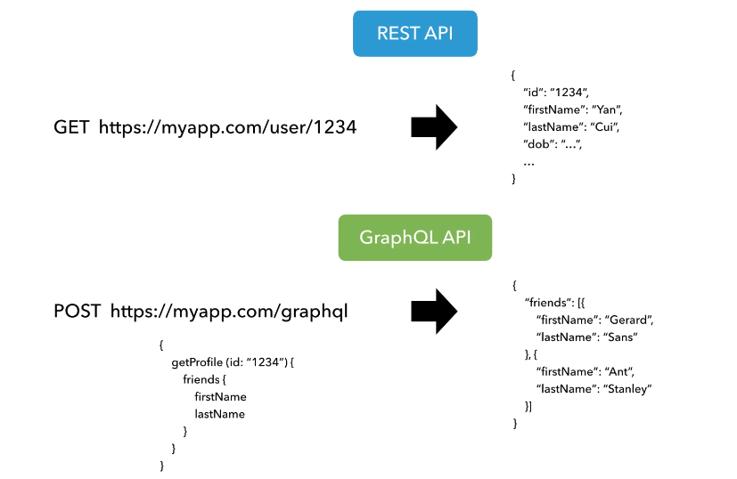
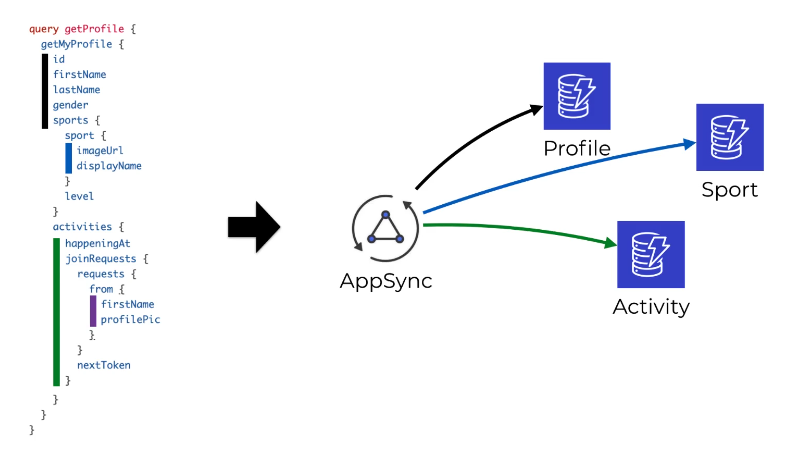

- AppSync:

  - First we need to learn some information about the GraphQl

    - GraphQl:

      1. GraphQL is a query language for APIs and a runtime for executing those queries with your existing data.
      2. Clients can specify exactly what data they need, and they will receive only that data.
         This helps in reducing over-fetching or under-fetching of data.
      3. Unlike REST APIs that may have multiple endpoints for different resources, GraphQL typically has a single endpoint.
         This simplifies the API surface and makes it easier to manage.
         Clients can send multiple queries in a single request, reducing the number of network requests and improving efficiency.
      4. GraphQL supports real-time updates through subscriptions. Clients can subscribe to specific events and receive real-time updates when the data changes.
         
         

      Strongly typed contracts between client and server. Implement "Joins"with DynamoDB effortlessly.

  - So what is AppSync and what is the key features of it?
    AWS AppSync is a fully managed service provided by Amazon Web Services (AWS) that makes it easy to develop GraphQL APIs by handling the heavy lifting of securely connecting to data sources like AWS DynamoDB, AWS Lambda, or any HTTP data source. It is designed to simplify the process of building scalable and secure real-time and offline-capable applications.

    - Multiple Data Sources: AppSync can connect to various data sources, including AWS DynamoDB, AWS Lambda, Amazon Elasticsearch, HTTP data sources, and more.
      This flexibility allows developers to use the right data source for their specific use case.

    - Offline Data Access: AppSync provides built-in support for offline data access.
      Clients can continue to interact with the app and make updates even when they are offline, and AppSync will synchronize the data once the connection is restored.
    - Authentication and Authorization: AppSync integrates with AWS Cognito for authentication and authorization.
      This allows developers to easily manage user identity and access control for their applications.
    - Built-in Resolver Mapping: AppSync simplifies the process of connecting to different data sources by using resolver mapping templates.
      Developers can define how data is fetched, updated, or deleted from the connected data sources.
    - AppSync provides built-in caching to improve the performance and reduce the latency of GraphQL queries.
    - AppSync provides built-in monitoring and logging features to help developers gain insights into the performance, usage, and errors of their GraphQL APIs.
      The monitoring capabilities are integrated into the AWS CloudWatch service, which is a comprehensive monitoring and management service provided by Amazon Web Services.
    - Managed Service: AWS AppSync is a fully managed service, meaning that AWS takes care of the operational aspects such as scaling,
      monitoring, and maintenance, allowing developers to focus on building applications.

  - AppSync VS API Gateway:

    1. RESTful and WebSocket Support:
       API Gateway is a more general-purpose API management service that supports both RESTful APIs and WebSocket APIs.
       While it can handle RESTful APIs like traditional HTTP-based services, it's not inherently tied to GraphQL.
       AppSync is a fully managed service that focuses on providing real-time and offline capabilities for applications.
       It is well-suited for scenarios where you need to build responsive, interactive applications with features like live updates and offline access.
       API Gateway has no support for broadcasting.

    2. Customizable and Extensible:
       API Gateway allows for more fine-grained control over the design of APIs.
       It supports custom domain names, request/response transformations, and the ability to integrate with Lambda functions, HTTP endpoints, and other AWS services.
       To use a custom domain with AWS AppSync, you typically create a CloudFront distribution and configure it to forward requests to your AppSync API. CloudFront is a content delivery network (CDN) service provided by AWS.

    3. API Gateway Authorizers and Custom Authorizers:
       API Gateway provides flexible authorization mechanisms, including API Gateway native authorizers and custom authorizers.
       This allows for robust access control and authentication mechanisms while APPSync not.
       But group based authentication is more easier to implement in APPSync and more steps and difficult in API Gateway because it has no built-in group based auth.

    4. Validation:
       API Gateway has request validationbut no response validation that may cause problems in case of unexpected behaviour such as sql injection.
       While APPSync provide validation on request and response.

  - APPSync VS GraphQl with Lambda:

    - AppSync has its own scaler types and no custom scaler types support while API Gateway supports.
    - the GraphQl with Lambda the request needs to go to each service and each service talks to a resolver if needed
      then the response back and collect in the API Gateway while AppSync talks directly to most AWS services.
       
    - APPSync provide Per-Resolver Matrics to access logging and monitor the resovvers.
    - API Gateway provides a custom authorization and usage plans like rate limits while APPSync not.
      But you can use API Gateway in front of APPSync to get these features also with APPSync.
      
    - APPSync also has no cold start problems because it talks directly to the services
      not like API Gateway that need lambda function to get data for example from DynamoDB.

  - AWS Amplify:
    AWS Amplify is a set of tools and services provided by (AWS) to simplify the process of developing
    and deploying scalable, secure, and feature-rich web and mobile applications.
    It offers a comprehensive set of services, libraries, and a command-line interface (CLI) that abstracts away
    much of the complexity involved in building and managing cloud-powered applications.

    1. Backend as a Service (BaaS):
       Amplify provides a (BaaS) that enables developers to quickly set up and configure backend services for their applications.
       This includes services for authentication, storage, APIs, and more.
    2. Authentication:
       Amplify simplifies user authentication by providing pre-built authentication flows for common identity providers
       such as Amazon Cognito, social identity providers, and more. Developers can easily integrate secure authentication into their applications.
    3. APIs:
       Amplify allows developers to define and deploy APIs quickly. This includes both RESTful APIs and GraphQL APIs.
       The GraphQL support is tightly integrated with AWS AppSync, making it easy to create and manage GraphQL APIs.
    4. Data Storage:
       Amplify supports various data storage options, including Amazon DynamoDB for NoSQL databases
       and Amazon Aurora Serverless for relational databases.
    5. Hosting:
       Amplify enables developers to deploy and host static web applications directly from the Amplify console or through the CLI.
       This allows for easy hosting of web applications with features like continuous deployment.
    6. Amplify Consol and CLI:
       The Amplify Console is a web-based user interface that allows developers to manage and monitor their Amplify applications.
       It provides a visual representation of the deployment pipeline and allows for easy monitoring of application metrics.
       The Amplify Command-Line Interface (CLI) allows developers to configure and manage their Amplify projects directly from the command line.
       It supports various commands for setting up authentication, APIs, storage, and more.

  - AWS Cognito:
    Cognito is a fully managed identity and access management service provided by Amazon Web Services (AWS). It is designed to handle user authentication, authorization, and user management for your web and mobile applications. Cognito is particularly useful for building secure and scalable applications with features such as user sign-up and sign-in, multi-factor authentication (MFA), and social identity provider integration

    1. User Pool:
       Cognito User Pools allow you to create and manage a user directory that scales to hundreds of millions of users. User Pools provide features for user registration, sign-in, and account recovery. You can customize authentication flows and configure password policies.

    2. Identity Pool:
       Cognito Identity Pools, also known as Federated Identities, enable your users to sign in through external identity providers (such as Amazon, Facebook, Google, or an OpenID Connect-compatible provider). Identity Pools provide temporary AWS credentials for accessing other AWS services

    Cognito supports social identity providers like Facebook, Google, and Amazon. This allows users to sign in using their existing social media accounts, simplifying the registration and authentication process

    Cognito provides analytics and monitoring features to track user sign-ins, sign-ups, and other user-related activities. This can help you gain insights into user behavior.
