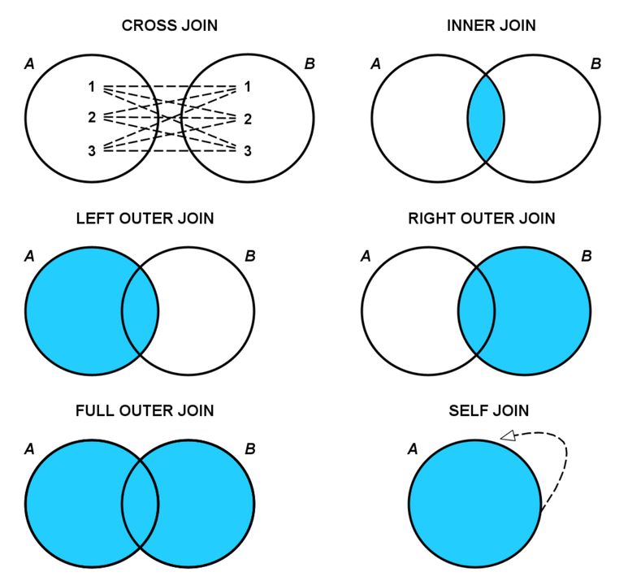

- differences between Databases:

  - databases have differences. for example,

  - SQLLite have advantages:
  - small footprints --> very lightweight and deosnt have any external dependencies.
  - user friendly --> sometimes describe as "Zero-Configuration". and it doesnt run as server so it doesnt need to stop.
  - Portable --> it doesn't store as seperate files like other databases,but store data in single file anywhere. so it can be shared like media files.
  - but also have disadvantages:

  - limited concurrency --> multiple processes can access databases but one process can change database at any given time.
  - Security --> databases that use server engine provide better security than serverless SQLLite.
    so its better to use SQLLite in some cases such as embedded systems or test DBMS because it has in-memory mode.

  - MySQL have advantages:

  - popularity and ease of use: one of the most world's Databases in the world.
  - Security: support user management and access priviellages
  - Speed: by choosing not to use some features of SQL, my sql users able to prioritize speed.
  - Replication: suppert number of different types of replications

  - MySQL disadvantages:

  - Known limitations: it comes with certain functional limitations. For example, it lacks support for FULL JOIN clauses,
    MySQL doesn’t have some of the functions for modifying dates as Postgres.
  - some features needs pay before use.
    so it's better to use MySQL in case of future growth, but in case of many users will writing data at once another RDBMS like postgres will be better to use.

  - Postgres have advantages:
  - SQL compliance: alot of SQL features with full power are available in Postgres.
  - Open-Source.
  - disadvantages:

  - Memory performance: For every new client connection, PostgreSQL forks a new process. Each new process is allocated about 10MB of memory,
    which can add up quickly for databases with lots of connections. Accordingly, for simple read-heavy operations,
    PostgreSQL is typically less performant than other RDBMSs, like MySQL.
  - Popularity: there are still fewer third-party tools that can help manage a PostgreSQL database.

- DDL: Any action manipulate the database structure (create database, tabel,...)
- DML: Any action manipulate the database tables contents
- DCL: Any action control the database like users permissions

- Charactersets Vs collations

  - Charactersets:
    - Character sets : the language which the content of the tables is written in
    - Collations : the behavior of the character is the same in all the character cases or different
      => a in germany has different behaviors
  - charactersets and collations can be determined at the beginning of the table creation or at the end of each query using keyword COLLATE.

- SQL Tips:

  - derived Column : a new column that is a manipulation of exiting columns in your database
  - when creating database its important to know how data will be stored in.
    this is knowen as Normalization.
    Normalization is part of successful database design.
    withot Normalization database systems can be slow, inaccurate and inefficient.
    goals of Normalization: - arranging data into logical groupings such that each group describes a small part of the whole. - minimizing the amount of duplicate data stored in a database. - rganizing the data such that, when you modify it, you make the change in only one place.
    Sometimes database designers refer to these goals in terms such as DATA INTEGRITY, REFERENTIAL INTEGRITY, or KEYED DATA ACCESS.

  - Foreign Key (FK)
    A foreign key is a column in one table that is a primary key in a different table.

  - in join:
    the best practice in ON statement is to always be foreign key equaling primary key. - does SQL enforce the ON statement be on the primary key equaling the foreign key ?
    It might be nice if SQL enforced JOINs to be PK = FK,
    but the answer is NO, if you want to join company name to the last name of another column, SQL will let you do it!

  - When you query to get rows with null value in any column "= NULL" is not going to work
    because null is not a value, it's a property of the data, it's different from 0 or ' '.
    instead you must use 'IS NULL' or 'IS NOT NULL'.

  - Some SQL statements

    - UNION => Merge results of two queries together.

  - Built-in functions

    - some of these functions (May be differ from database to another)

    - ABS() => returns the absolute value.
    - ASCII() => returns the ASCII representation of the value.
    - CHAR() => returns the character representation of the ASCII value.
    - ADDDATE() => add days to the date
    - DAY() => extract days from the date
    - DAYNAME() => returns the day name
    - MONTH() => extract months from the date
    - MONTHNAME() => returns the month name
    - CURDATE() => returns the current date,
    - CONCAT() => concatenate some of strings together
    - LENTH() => returns the length of the string
    - LOWER() => returns the lowercase version of the string
    - TRIM() => remove the extra spaces or specific character from the end and start of the string
    - ISNULL() => returns true if the value is null- undefined is null, empty string is not null
    - IF(comparason, if True do, if False do)

  - Aggregation:

    - aggregators only aggregate vertically - the values of a column.
      If you want to perform a calculation across rows, you would do this with simple arithmetic.

    - COUNT : COUNT does not consider rows that have NULL value.
    - SUM : you can only use SUM on numeric columns. However, SUM will ignore NULL values.
    - MIN - MAX
      Functionally, MIN and MAX are similar to COUNT in that they can be used on non-numerical columns.
      Depending on the column type, MIN will return the lowest number, earliest date, or non-numerical value as early in the alphabet as possible.
      As you might suspect, MAX does the opposite—it returns the highest number, the latest date, or the non-numerical value closest alphabetically to “Z.”
    - AVG
      AVG returns the mean of the data - that is the sum of all of the values in the column divided by the number of values in a column.
      This aggregate function again ignores the NULL values in both the numerator and the denominator.

    - NOTE THAT:
      One quick note that a median might be a more appropriate measure of center for this data,
      but finding the median happens to be a pretty difficult thing to get using SQL alone
    - so difficult that finding a median is occasionally asked as an interview question.
      more than way to find median is on STACKOVERFLOW

    - GROUP BY
      - can be used to aggregate data within subsets of the data.
        For example, grouping for different accounts, different regions, or different sales representatives.
      - Any column in the SELECT statement that is not within an aggregator must be in the GROUP BY clause.
      - The GROUP BY always goes between WHERE and ORDER BY.
      - You can GROUP BY multiple columns at once, as we showed here.
        This is often useful to aggregate across a number of different segments.
        The order of column names in your GROUP BY clause doesn’t matter.
        The order of columns listed in the ORDER BY clause does make a difference.
        You are ordering the columns from left to right.
    - Having
      - HAVING is the “clean” way to filter a query that has been aggregated, but this is also commonly done using a subquery.
        Essentially, any time you want to perform a WHERE on an element of your query that was created by an aggregate,
        you need to use HAVING instead.
      - Having appears after the GROUP BY but before ORDER BY.
    - DATE

      - DATE_TRUNC:
        allows you to truncate your date to a particular part of your date-time column.
        Common trunctions are day, month, and year.
      - DATE_PART: can be useful for pulling a specific portion of a date,
        but notice pulling month or day of the week (dow) means that you are no longer keeping the years in order.
        Rather you are grouping for certain components regardless of which year they belonged in.

    - CASE
      - The CASE statement always goes in the SELECT clause.
      - CASE must include the following components: WHEN, THEN, and END.
        ELSE is an optional component to catch cases that didn’t meet any of the other previous CASE conditions.
      - You can make any conditional statement using any conditional operator (like WHERE) between WHEN and THEN.
        This includes stringing together multiple conditional statements using AND and OR.
      - You can include multiple WHEN statements, as well as an ELSE statement again, to deal with any unaddressed conditions.

  - ## JOIN:

    - 
    - SQL joins are used to combine data from two or more tables in a relational database based on a related column between them.
      Joins are fundamental to querying and retrieving information from databases efficiently.
      There are several types of SQL joins, including:

    - INNER JOIN:The INNER JOIN returns only the rows that have matching values in both
      tables.Syntax:SELECT column1, column2, ... FROM table1 INNER JOIN table2 ON table1.column_name = table2.column_name;

    - LEFT (OUTER) JOIN:The LEFT JOIN returns all the rows from the left table and the matched rows from the right table.
      If there is no match, NULL values are returned for columns from the right
      table.Syntax:SELECT column1, column2, ... FROM table1 LEFT JOIN table2 ON table1.column_name = table2.column_name;

    - RIGHT (OUTER) JOIN:The RIGHT JOIN returns all the rows from the right table and the matched rows from the left table.
      If there is no match, NULL values are returned for columns from the left
      table.Syntax:SELECT column1, column2, ... FROM table1 RIGHT JOIN table2 ON table1.column_name = table2.column_name;

    - FULL (OUTER) JOIN:The FULL JOIN returns all rows when there is a match in either the left or right table.
      If there is no match, NULL values are returned for columns from the non-matching
      table.Syntax:SELECT column1, column2, ... FROM table1 FULL JOIN table2 ON table1.column_name = table2.column_name;

    - CROSS JOIN:The CROSS JOIN returns the Cartesian product of two tables,
      meaning it combines every row from the first table with every row from the second table, resulting in a potentially large result
      set.Syntax:SELECT column1, column2, ... FROM table1 CROSS JOIN table2;

    - SELF JOIN:A self join is a join where a table is joined with itself.
      This can be useful when you have hierarchical data or need to compare rows within the same
      table.Syntax:SELECT column1, column2, ... FROM table1 AS t1 INNER JOIN table1 AS t2 ON t1.column_name = t2.column_name;

    - When using SQL joins, it's important to specify the columns that are used for joining
      and to understand the relationships between the tables in your database schema.
      Joining tables efficiently can significantly impact the performance of your SQL queries,
      so it's important to use the appropriate join type for your specific use case.

    - You can replace ON keyword in join by USING keyword in case of the both tables have the same name in the used join column
      ex: ON table1.ID = table2.ID => USING(ID)
