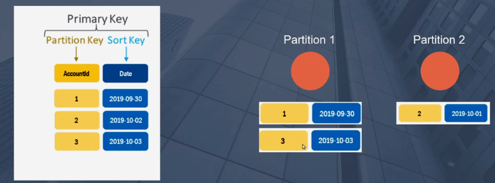

- DynamoDB:

  - What is DynamoDB ?

    - Scalability: DynamoDB is designed for seamless horizontal scaling.
      As your application grows, you can easily increase the read and write capacity to accommodate higher traffic.
    - Performance: DynamoDB offers low-latency access to data with consistent and predictable performance,
      making it suitable for real-time applications.

  - Primary Key:

    - consist of unique partition key elements or a unique combination of partition and sort keys
    - Dynamo uses the partition key to create the hash table and seperate data into partitions and uses this
      key to know which partition to use for your queries.
      

    - Sort Key (Range Key): The sort key is optional, and it is used to organize items within a partition.
      It enables efficient querying and sorting of data within a partition.
      Items with the same partition key but different sort keys are ordered based on the sort key.
      A sort key value is sometimes referred to as a range key.

  - DAX:

    - Amazon DynamoDB Accelerator (DAX) is a fully managed, highly available caching service built for Amazon DynamoDB.
      DAX delivers up to a 10 times performance improvement—from milliseconds to microseconds—even at millions of requests per second.
    - DAX does all the heavy lifting required to add in-memory acceleration to your DynamoDB tables,
      without requiring developers to manage cache invalidation, data population, or cluster management.

  - GSI:

    - Global Secondary Index is an index with a partition key and an optional sort key that is different from the primary key of the table.
      This allows you to query and retrieve data from DynamoDB using non-primary key attributes.
    - GSIs are useful when you need to perform queries that are not efficiently supported by the primary key of the table.
    - You can create multiple GSIs on a single table to support different query patterns.
    - ike the main table, a GSI has its own provisioned throughput (read and write capacity units).
      You can adjust the provisioned throughput for GSIs independently of the main table.
    - The cost is based on the provisioned throughput capacity, regardless of whether you fully utilize it or not.
      You can independently provision read and write capacity for each GSI based on your application's needs.
      In addition to provisioned throughput costs, you are also charged for the storage of data in the GSI.

    - ## So what is the differences between GSIs and the traditional Indexes?
      - GSIs have their own provisioned write and read capacity separate from the base table.
        This means you can specify different throughput settings for your GSI, allowing you to optimize performance based on your specific query patterns.
      - In many SQL databases, indexes are closely tied to the table's structure, and their write and read performance impact is generally a part of the overall table's performance.
      - When writing to a DynamoDB table, the write to the GSI might not be immediately reflected, and there might be some delay in consistency.
        DynamoDB provides eventual consistency for GSIs.
      - In SQL databases, indexes are typically maintained for consistency as part of the transactional process.

  - LSI:

    - LSI (Local Secondary Index) is a type of secondary index that allows you to query and retrieve data from a table using an alternative sort key in addition to the primary key
    - You must define LSIs when creating the table; they cannot be added or removed later.
    - An LSI is created with one or more attributes that are part of the table's primary key.
    - LSIs share provisioned throughput (read and write capacity units) with the base table.
      Any read or write capacity consumed by queries on the LSI is deducted from the provisioned capacity of the table.

      ```sql
      Table: Employee

      - Primary Key: (EmployeeID - Partition Key, DateOfBirth - Sort Key)
      - LSI: (EmployeeID - Partition Key, Salary - Sort Key)

      ```

  - Auto Scaling:

    - Auto Scaling is a feature provided by Amazon DynamoDB that helps automatically adjust the provisioned read and write capacity for your tables in response to changes in application traffic
    - It automatically increases or decreases provisioned capacity in response to changes in application demand.
    - You can set up target tracking scaling policies for your DynamoDB tables.
      These policies allow you to specify a target utilization percentage for read and write capacity, and Auto Scaling adjusts the provisioned capacity to maintain that target.
    - You can configure warm-up and cooldown periods to control how quickly Auto Scaling adjusts capacity in response to changes in traffic.
    - To set up Auto Scaling for your DynamoDB tables, you typically define scaling policies and associate them with CloudWatch alarms.
      These alarms are triggered based on metrics such as consumed capacity and are used to dynamically adjust the provisioned capacity.

  - Streaming:

    - DynamoDB Streams provide a time-ordered sequence of item-level modifications in a DynamoDB table.
    - Changes include additions, updates, or deletions of items in the table.
    - DynamoDB Streams can be integrated with other AWS services, such as AWS Lambda, Amazon Kinesis, and Amazon Simple Notification Service (SNS).
    - You can use these integrations to perform various actions in response to changes in the DynamoDB table.
      ex1: When changes occur in the associated DynamoDB table, the Lambda function is automatically triggered.
      ex2: Common use cases for DynamoDB Streams include auditing changes to items, replicating data across multiple tables or regions, and triggering workflows in response to changes.

    - Old image - New image:
      - Old Image: The "old image" represents the state of an item in the DynamoDB table before a change occurs.
        For example, if an item is updated, the old image will contain the attribute values as they were before the update.
    - New Image: The "new image" represents the state of an item in the DynamoDB table after a change occurs.
      Following the example above, if an item is updated, the new image will contain the attribute values as they are after the update.
